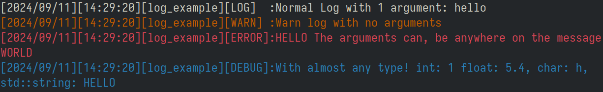

# THIS IS THE OLD, DEPRECATED VERSION OF THE LogNest library, that was originally written in C++ and had a horrible design pattern, i find it entresting enough to be kept arround as a learning exercice on what not to do.

## Advantages of [the C version](https://github.com/LeaoMartelo2/lognest):
- 50% less bullshit in the code (here we'll get syntax sugar overdose)
- 20% less included libraries! (here you had to link with like 2 other libraries, was a dinamically linked, so you needed the final user to install it, wich, for a library as small as this is not worth it, you might aswell just bake it in the executable, also the new design pattern allows you to just copy the code and add it directly in your project, no installing needed)

# LogNest

Simple C++ library to easily make logs on to a file.

## Installing:

`git clone https://github.com/LeaoMartelo2/LogNest`

`cd LogNest/src`

`sudo make install` 

<small>(or install manually to your project if you know what you are doing)</small>

##Requireaments:

- fmt library

- make (for facilitating the process)

# Usage:
- The main header should be included: 
`#include <lognest/lognest.hpp`

- To begin using the library, you'll need to create a logging object, you can have multiple of them, and they can even be channeled in to different files.
`auto log_example = std::make_shared<LogNest>("latest.log", "[log_example]")`;
	- here, the first argument (`latest.log`) defines the file that object's logging will be channeled in to (accepts path's).
	- the second argument (`[log_example]`), will be the identifier of the logging object, in case there are multiple objects logging to the same file.
	
- Following the example given above, we can create a log using
`log_example->log(LN_LOG, "Hello, {}", "World!");`
	- You can use the provided log types, all of them have the prefix `LN`
	- (`LN_LOG`, `LN_WARN`, `LN_ERROR`, `LN_DEBUG`)
	- The text argument takes a formatting argument `{}`, that will be replaced with the next argument provided after it.
	- Example: (`"{}, {}!", "Hello, World", 2024`)
